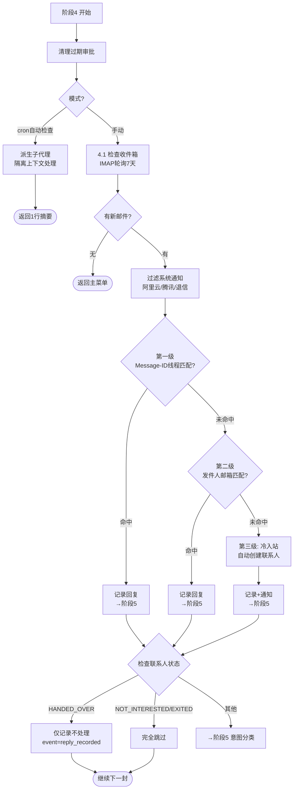
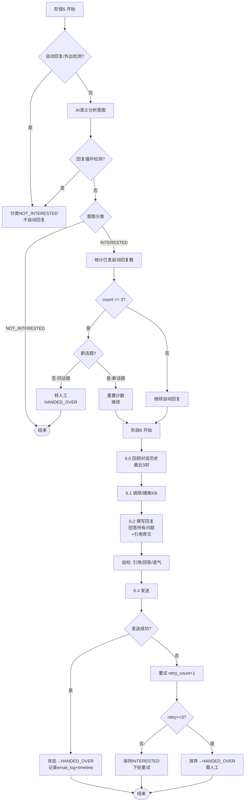

# card-followup Skill 流程图

> 根据 `.claude/skills/card-followup/skill.md` 梳理的完整流程。
> 更新时间：2026-08-13

## 总览流程图

```mermaid
flowchart TD
    START([用户发起请求]) --> P0{阶段0<br/>IM 会话检测}

    P0 -->|图片消息<br/>[Image saved at:| IMG[IM 入站处理<br/>im-inbound-processor]
    P0 -->|批准/拒绝文本| APPR[审批处理<br/>pending_approvals]
    P0 -->|IM 其他文本| IMOTHER[直接理解意图执行<br/>cc-connect send + NO_REPLY]
    P0 -->|终端会话| P1

    IMG --> END0([结束])
    APPR --> END0
    IMOTHER --> END0

    P1[阶段1: 主菜单<br/>AskUserQuestion] --> MENU{选择操作}
    MENU -->|输入新名片| P2
    MENU -->|检查回复| P4
    MENU -->|查看状态| VIEW[查看联系人状态]
    MENU -->|交接| HANDOFF[交接给团队]
    MENU -->|设置/验证| SETUP[设置系统]
    MENU -->|切换开关| TOGGLE[翻转配置]

    P2[阶段2: 名片输入与去重] --> DEDUP{联系人已存在?}
    DEDUP -->|是| EXISTS[更新备注/看历史/返回]
    DEDUP -->|否| CREATE[创建联系人<br/>+workflow_state+timeline]
    EXISTS --> END1([返回主菜单])
    CREATE --> TZ[检测时区]

    TZ --> P3[阶段3: AI分析与生成邮件]
    P3 --> GEN[调研网站+读KB<br/>生成个性化草稿]
    GEN --> APPROVE{autoApproveDrafts?}
    APPROVE -->|true| AUTO_SEND[直接发送]
    APPROVE -->|false| REVIEW[人工审批草稿]
    REVIEW -->|取消| END2([存草稿返回])
    REVIEW -->|编辑| REVIEW
    REVIEW -->|发送| WORKHOURS{工作时间检查}

    AUTO_SEND --> WORKHOURS
    WORKHOURS -->|工作时间内| SEND[发送邮件]
    WORKHOURS -->|工作时间外| SCHEDULE[定时发送]
    SEND --> LOG3[记录email_log+状态]
    SCHEDULE --> END3([结束-等待定时])
    LOG3 --> END3

    P4[阶段4: 回复检查] --> P4_DETAIL[三级匹配详情]
    P4_DETAIL --> P5[阶段5: 意图分类]
    P5 --> INTENT{意图?}
    INTENT -->|NOT_INTERESTED| END4([结束])
    INTENT -->|INTERESTED| LIMIT{自动回复限制<br/>>=3?}
    LIMIT -->|是-同话题| HANDOVER4[转人工HANDED_OVER]
    LIMIT -->|否/新话题| P6[阶段6: 自动回复]
    HANDOVER4 --> END4
    P6 --> COMPOSE[回顾历史+读KB<br/>撰写回复+引用原文]
    COMPOSE --> SEND6[发送自动回复]
    SEND6 --> HANDOVER6[状态→HANDED_OVER<br/>需人工跟进物流]
    HANDOVER6 --> END4

    VIEW --> END1
    HANDOFF --> END1
    SETUP --> END1
    TOGGLE --> P1
```

## 阶段 4 详图：三级回复匹配



## 阶段 5-6 详图：意图分类与自动回复



## 待确认的问题

1. **阶段 3 工作时间检查**：外展邮件要检查，回复邮件跳过。自动批准（AUTO_SEND）路径也走到了工作时间检查，符合预期吗？
2. **阶段 4 三级匹配兜底**：三级全失败（解析不出发件人邮箱）时「显示并跳过」，不创建联系人。
3. **阶段 5 安全阀顺序**：回复循环检测 和 自动回复限制（>=3）是串行执行（先循环检测后计数），实际执行顺序是否一致？
4. **冷入站**：第三级创建的联系人直接进阶段 5 分类，不先走去重。
